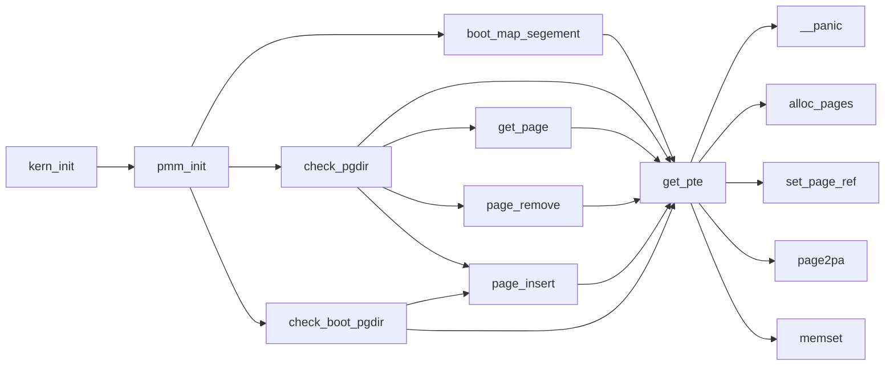
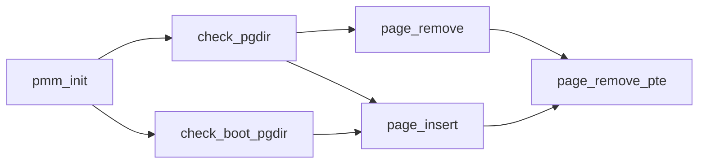
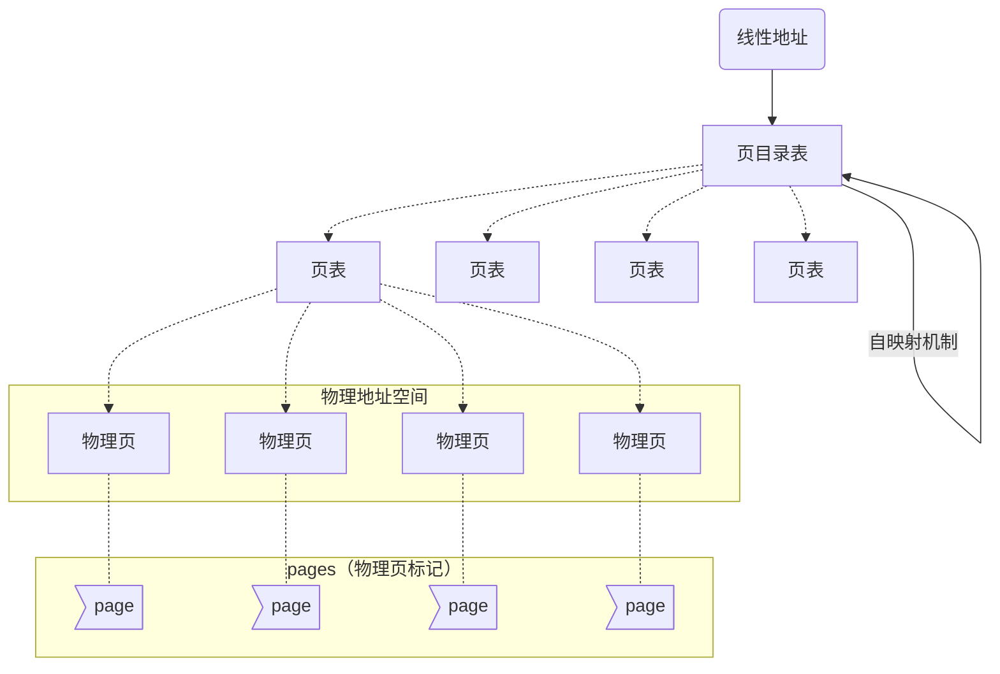

# Lab2
*鸭鸭(1)班 HoTay*
***
## 练习0
> 填写已有实验

将LAB1中完成的代码（不包含拓展练习）移植到了lab2的框架中，涉及到的文件为kern/debug/kdebug.c，kern/init/init.c和kern/trap/trap.c，具体内容已在LAB1报告中进行说明，此处不再赘述；

但值得注意的是，在LAB1中实现的内核态和用户态相互切换的功能在LAB2中无法使用；这是因为在LAB2中，在entry.S中创建的空间`bootstack`既作为`kern_init()`的函数调用栈，又作为内核态时使用的内核栈，因此从用户态进入内核态时，在同一个空间中切换不同的栈会导致上一个栈被覆盖，从而导致函数返回地址异常并触发缺页中断；而在LAB1中，`kern_init()`使用的是由bootasm.S创建的空间，范围为`0-0x7C00`，内核态则使用`stack0`作为单独的内核栈，二者不冲突；
*** 
## 练习1
> 实现first-fit连续物理内存分配算法

### 1. first fit算法的设计与实现
在default_pmm.c中设计了以下几个函数并实现了`pmm_manager`接口以供pmm.c调用
* `default_init`：初始化`free_list`
* `default_init_memmap`：将空闲页面加入`free_list`
* `default_alloc_pages`：分配指定数量的内存页面
* `default_free_pages`：归还指定起始位置、指定数量的内存页面
* `default_nr_free_pages`：返回空闲内存页面数

#### 1) default_init
```cpp
static void
default_init(void) {
    list_init(&free_list);
    nr_free = 0;
}
```
该部分的代码较为简单，仅仅是将空闲页面链表的`pre`和`next`指针指向自身，并将空闲页面数置零

#### 2) default_init_memmap
```cpp
static void
default_init_memmap(struct Page *base, size_t n) {
    assert(n > 0);
    struct Page *p = base;
    for (; p != base + n; p ++) {
        assert(PageReserved(p));
        p->flags = p->property = 0;
        SetPageProperty(p);
        set_page_ref(p, 0);
    }
    base->property = n;
    nr_free += n;
    list_add_before(&free_list, &(base->page_link));
}
```
* 通过base加偏移量来遍历新加入的空闲页面，将它们的`flags`和`property`都置零，并设置Property为空闲，且将页面引用数也设为零
```cpp
struct Page *p = base;
for (; p != base + n; p ++) {
    assert(PageReserved(p));
    p->flags = p->property = 0;
    SetPageProperty(p);
    set_page_ref(p, 0);
}
```
* 将第一个页面的`property`设置为n（即此次加入的空闲页面数），然后更新`nr_free`，并将其插入到`free_list`循环链表的头指针之前（以保证插入的空闲块是按内存地址顺序递增的）
```cpp
base->property = n;
nr_free += n;
list_add_before(&free_list, &(base->page_link));
```

#### 3) default_alloc_pages
```cpp
static struct Page *
default_alloc_pages(size_t n) {
    assert(n > 0);
    if (n > nr_free) {
        return NULL;
    }
    struct Page *page = NULL;
    list_entry_t *le = &free_list;
    while ((le = list_next(le)) != &free_list) {
        struct Page *p = le2page(le, page_link);
        if (p->property >= n) {
            page = p;
            break;
        }
    }
    if (page != NULL) {
        le = list_next(le);
        list_del(&(page->page_link)); 
        if (page->property > n) {
            struct Page *p = page + n;
            p->property = page->property - n;
            list_add_before(le, &(p->page_link));
        }
        nr_free -= n;
        for (struct Page *p = page; p != page + n; p ++) {
            ClearPageProperty(p);
        }
    }
    return page;
}
```
* 遍历`free_list`查找页面数大于n的空闲内存块
```cpp
struct Page *page = NULL;
list_entry_t *le = &free_list;
while ((le = list_next(le)) != &free_list) {
	struct Page *p = le2page(le, page_link);
	if (p->property >= n) {
		page = p;
		break;
	}
}
```
* 将找到的空闲内存块从`free_list`中删除；如果请求的页面数n小于当前空闲内存块的大小，则将该内存块分裂成两块，前一块为n，后一块归还给`free_list`；取得向后n个页面后的节点（剩下的内存页面），将其加入原空闲内存块的位置，将分配出去的页面都设置为占用（清除Property），更新`nr_free`
```cpp
if (page != NULL) {
	le = list_next(le); // 记住原空闲内存块的下一个节点，以便后续插入
	list_del(&(page->page_link)); 
	if (page->property > n) {
		struct Page *p = page + n;
		p->property = page->property - n;
		list_add_before(le, &(p->page_link)); // 插入到原空闲内存块位置
	}
	nr_free -= n;
    for (struct Page *p = page; p != page + n; p ++) {
        ClearPageProperty(p);
    }
}
```

#### 4) default_free_pages
```cpp
static void
default_free_pages(struct Page *base, size_t n) {
    assert(n > 0);
    struct Page *p = base;
    for (; p != base + n; p ++) {
        assert(!PageReserved(p) && !PageProperty(p));
        p->flags = 0;
        SetPageProperty(p);
        set_page_ref(p, 0);
    }
    base->property = n;
    list_entry_t *le = list_next(&free_list);
    while (le != &free_list) {
        p = le2page(le, page_link);
        le = list_next(le);
        if (base + base->property == p) {
            base->property += p->property;
            list_del(&(p->page_link));
        }
        else if (p + p->property == base) {
            p->property += base->property;
            base = p;
            list_del(&(p->page_link));
        }
        else if (base + base->property < p) {
            break;
        }
    }
    if (le == &free_list) {
        p = le2page(le, page_link);
    }
    nr_free += n;
    list_add_before(&(p->page_link), &(base->page_link));
}
```
* 将待归还内存块的每个页面的`flags`以及引用数都置零，且将Property设置为空闲，并设置头节点的property
```cpp
struct Page *p = base;
for (; p != base + n; p ++) {
	assert(!PageReserved(p) && !PageProperty(p)); // 验证页面是否都是已分配的
	p->flags = 0;
    SetPageProperty(p);
	set_page_ref(p, 0);
}
base->property = n;
```
* 遍历空闲内存块链表，将可以和当前待归还内存块合并的内存块取出与其合并，并找到待归还内存块在链表中应该插入的位置
```cpp
list_entry_t *le = list_next(&free_list);
while (le != &free_list) {
	p = le2page(le, page_link);
	le = list_next(le); // 下一个节点
	if (base + base->property == p) { // 若有空闲块刚好可以接在base尾部
		base->property += p->property;
		list_del(&(p->page_link));
	}
	else if (p + p->property == base) { // 若有空闲块刚好可以接在base头部
		p->property += base->property;
		base = p;
		list_del(&(p->page_link));
	}
	else if (base + base->property < p) { // 遍历位置的地址刚大于base尾部地址，是base需要被插入的位置，break
		break;
	}
}
if (le == &free_list) { // 若遍历结束仍未有找到插入位置，则插入在链表尾部
	p = le2page(le, page_link);
}
```
* 将待归还空闲块插入到指定位置之前，并更新`nr_free`
```cpp
nr_free += n;
list_add_before(&(p->page_link), &(base->page_link));
```
#### 5) default_nr_free_pages
```cpp
static size_t
default_nr_free_pages(void) {
    return nr_free;
}
```
返回`nr_free`

**注意：源代码注释中对`PG_property`的描述与实际实现不符——不仅空闲头节点页面应该设为1，空闲非头节点页面也应该设为1；这样才可以检测出重复释放内存的情况**

### 2. 你的first fit算法是否有进一步的改进空间
有，该内存分配算法是基于链表实现的，在查找上的时间复杂度为$O(n)$，效率较低；因此可以改为其他方法实现，例如基于二叉排序树的实现
***
## 练习2
> 实现寻找虚拟地址对应的页表项（需要编程）

### 1. `get_pte()`设计与实现
要实现二级页表，需要先实现`get_pte()`，该函数的作用是返回指向线性地址对应的页表项的指针，以下是`get_pte()`的调用关系：


`get_pte`的实现如下：
```cpp
pte_t *
get_pte(pde_t *pgdir, uintptr_t la, bool create) {
    pde_t *pdep = &pgdir[PDX(la)]; 
    if (create == 0 && !(*pdep & PTE_P)) {
        return NULL;
    }
    else if (!(*pdep & PTE_P)) {
        struct Page *p = alloc_page();
        if (p == NULL) {
            panic("boot_alloc_page failed.\n");
        }
        set_page_ref(p, 1);
        uint32_t pa = page2pa(p);
        memset(KADDR(pa), 0, PGSIZE);
        *pdep = pa | PTE_U | PTE_W | PTE_P;
    }
    return &((pte_t*)KADDR(PDE_ADDR(*pdep)))[PTX(la)];
}
```

* 取得指向线性地址对应的页目录表项的指针
```cpp
pde_t *pdep = &pgdir[PDX(la)]; 
```

* 如果对应的页表不存在，根据传入的`create`参数，返回空或分配一个页目录表
```cpp
if (create == 0 && !(*pdep & PTE_P)) {
    return NULL;
}
else if (!(*pdep & PTE_P)) {
    struct Page *p = alloc_page(); // 分配一个新页面
    if (p == NULL) {
        panic("boot_alloc_page failed.\n");
    }
    set_page_ref(p, 1); // 将引用数设为1
    uint32_t pa = page2pa(p); // 取得该页面对应的物理地址
    memset(KADDR(pa), 0, PGSIZE); // 转化为内核地址(+0xC0000000)后，将该页内容置0
    *pdep = pa | PTE_U | PTE_W | PTE_P; // 将新分配页的物理地址填入页目录表
}
```

* 返回指向线性地址对应的页表项的指针
```cpp
return &((pte_t*)KADDR(PDE_ADDR(*pdep)))[PTX(la)];
```

### 2. 请描述页目录项(Page Directory Entry)和页表项(Page Table Entry)中每个组成部分的含义以及对ucore而言的潜在用处
#### 1) 我们在ucore中可以看到的PDE和PTE如下
| 12~31                     | 0~11                    |
|---------------------------|-------------------------|
| 页面起始物理地址 & ~0xFFF | PTE_U \| PTE_W \| PTE_P |

可以发现无论是PTE还是TDE，都具有着一些保留的位供操作系统使用，也就是说ucore可以利用这些位来完成一些其他的内存管理相关的算法，比如可以在这些位里保存最近一段时间内该页的被访问的次数（仅能表示0-7次），用于辅助近似地实现虚拟内存管理中的换出策略的LRU之类的算法；也就是说这些保留位有利于OS进行功能的拓展；

#### 2) PDE和PTE详细组成如下
* PDE（页目录表）
  * 前20位表示4K对齐的该PDE对应的页表起始位置（物理地址，该物理地址的高20位即PDE中的高20位，低12位为0）；
  * 第9-11位未被CPU使用，可保留给OS使用；
  * 接下来的第8位可忽略；
  * 第7位用于设置Page大小，0表示4KB；
  * 第6位恒为0；
  * 第5位用于表示该页是否被使用过；
  * 第4位设置为1则表示不对该页进行缓存；
  * 第3位设置是否使用write through缓存写策略；
  * 第2位表示该页的访问需要的特权级；
  * 第1位表示是否允许读写；
  * 第0位为该PDE的存在位；

| 12~31                           | 9~11   | 8 | 7 | 6 | 5 | 4 | 3 | 2   | 1   | 0 |
|---------------------------------|--------|---|---|---|---|---|---|-----|-----|---|
| Page Table 4-kb aligned Address | Avail. | G | S | 0 | A | D | W | U/S | R/W | P |

* PTE（页表项）
  * 高20位与PDE相似的，用于表示该PTE指向的物理页的物理地址；
  * 9-11位保留给OS使用；
  * 7-8位恒为0；
  * 第6位表示该页是否为dirty，即是否需要在swap out的时候写回外存；
  * 第5位表示是否被访问；
  * 3-4位恒为0；
  * 0-2位分别表示存在位、是否允许读写、访问该页需要的特权级；

| 12~31              | 9~11   | 8 | 7 | 6 | 5 | 4 | 3 | 2   | 1   | 0 |
|--------------------|--------|---|---|---|---|---|---|-----|-----|---|
| Page Frame Address | Avail. | 0 | 0 | D | A | 0 | 0 | U/S | R/W | P |


### 3. 如果ucore执行过程中访问内存，出现了页访问异常，请问硬件要做哪些事情？
页访问异常，即cpu在页机制下访问某地址时，无法从页表中查寻到对应的物理页（存在位为0)，此时触发缺页中断：
* 将发生错误的线性地址保存在cr2寄存器中;
* 在内核栈中依次压入EFLAGS，CS，EIP，以及page fault对应的error code，如果page fault是发生在用户态，则还需要先压入ss和esp，并且切换到内核栈；
* 根据中断描述符表查询到对应page fault的中断服务例程地址，跳转到对应的中断服务例程处执行处理；
***
## 练习3
> 释放某虚拟地址所在的页并取消二级页表项的映射（需要编程）

### 1. `page_remove_pte()`的设计与实现
需要实现的函数是`page_remove_pte()`，该函数的作用是取消页表项到物理页面的映射，以下是`page_remove_pte()`的调用关系：


`page_remove_pte()`的实现如下：
```cpp
static inline void
page_remove_pte(pde_t *pgdir, uintptr_t la, pte_t *ptep) {
   if (*ptep & PTE_P) {
       struct Page *page = pte2page(*ptep);
       if (page_ref_dec(page) == 0) {
           free_page(page);
       }
       *ptep = 0;
       tlb_invalidate(pgdir, la);
   }
}
```

* 若物理映射页面存在，通过页表项取得页面，将页面引用数置零并释放页面
```cpp
struct Page *page = pte2page(*ptep);
if (page_ref_dec(page) == 0) {
    free_page(page);
}
```

* 将页表项清空  
`*ptep = 0;`

### 2. 数据结构Page的全局变量（其实是一个数组）的每一项与页表中的页目录项和页表项有无对应关系？如果有，其对应关系是啥？
* Page数组的每一项代表了一个物理页面，而页表项中所存储的是物理页的物理地址；物理地址除以页面大小，再乘以Page结构体的大小即可获得一个偏移量，通过将该偏移量加到Page数组的基地址即可得到该物理地址所对应的Page

* 以下是二级页表作用下，线性的地址和物理地址以及Page的关系


### 3. 如果希望虚拟地址与物理地址相等，则需要如何修改lab2，完成此事？ 鼓励通过编程来具体完成这个问题
由于ucore在链接时指定的起始加载地址为`0xC0100000`，而bootloader却将其加载到`0x100000`，因此导致虚拟地址与物理地址不同；要想使两者相等，则需要将tools/kernel.ld中的`. = 0xC0100000;`改为`. = 0x100000;`，并将kern/mm/memalyout.h中的`KERNBASE`重新定义为`0x00000000`
***
注：汇遍下，顺序执行无问题，若遇到跳转，才需要用到段页机制
