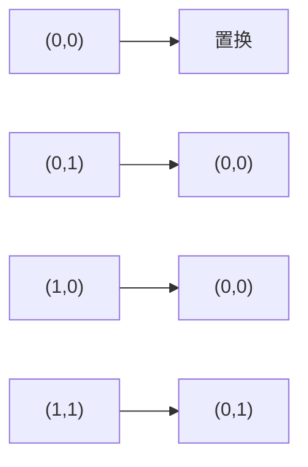

# Lab3
*鸭鸭(1)班 HoTay*
***
## 练习0
> 填写已有实验

将之前的lab中完成的代码（不包含拓展练习）移植到了lab2的框架中，涉及到的文件为kern/debug/kdebug.c，kern/init/init.c，kern/trap/trap.c，kern/mm/default_pmm.c和kern/mm/pmm.c

#### 存在的问题：
在kern/mm/pmm.c的`check_boot_pgdir()`中存在如下代码：
```cpp
struct Page *p;
p = alloc_page();
assert(page_insert(boot_pgdir, p, 0x100, PTE_W) == 0);
assert(page_ref(p) == 1);
assert(page_insert(boot_pgdir, p, 0x100 + PGSIZE, PTE_W) == 0);
assert(page_ref(p) == 2);

const char *str = "ucore: Hello world!!";
strcpy((void *)0x100, str);
assert(strcmp((void *)0x100, (void *)(0x100 + PGSIZE)) == 0);

*(char *)(page2kva(p) + 0x100) = '\0';
assert(strlen((const char *)0x100) == 0);

free_page(p);
free_page(pde2page(boot_pgdir[0]));
boot_pgdir[0] = 0;
```
其中调用`page_insert()`建立虚拟页和物理页的对应关系后，没有调用`page_remove()`；而仅仅是释放了物理页和页表，并将对应的页目录表项置0；这样在QEMU6.5.0下运行时，TLB的内容并不会被刷新，在之后的lab3实验中，会导致对该区域内存的读写无法触发page_fault中断，从而导致实验无法进行；而这个问题在QEMU2.5.0中不会出现，或者更新到ucore2018年以后的版本（新版lab2）也不会出现
*** 
## 练习1
> 给未被映射的地址映射上物理页

### 1. `do_pgfault()`函数的设计与实现

在启动分页机制以后，如果一条指令或数据的虚拟地址所对应的物理页框不在内存中或者访问的类型有错误（比如写一个只读页或用户态程序访问内核态的数据等），就会发生页访问异常；当出现上面情况之一，那么就会产生页面page fault异常；CPU会把产生异常的线性地址存储在CR2中，并且把表示访问异常类型的值（简称页访问异常错误码，errorCode）保存在中断栈中
> 页访问异常错误码有32位；位0为1表示对应物理页步存在；位1为1表示写异常（比如写了只读页；位2为1表示访问权限异常（比如用户态程序访问内核空间的数据）

在发生page fault异常后，CPU会跳转到中断号`0xE`对应的中断处理例程处执行（即vector.S中的标号`vector14`处），在保存已经没有保存的寄存器后，再跳转到`trap()`函数处，并按以下调用关系最终跳转到`do_pgfault()`处：


其中，kern/mm/vmm.c中`do_pgfault()`的代码实现如下：
```cpp
int
do_pgfault(struct mm_struct *mm, uint32_t error_code, uintptr_t addr) {
    int ret = -E_INVAL;
    //try to find a vma which include addr
    struct vma_struct *vma = find_vma(mm, addr);

    pgfault_num++;
    //If the addr is in the range of a mm's vma?
    if (vma == NULL || vma->vm_start > addr) {
        cprintf("not valid addr %x, and  can not find it in vma\n", addr);
        goto failed;
    }
    //check the error_code
    switch (error_code & 3) {
    default:
            /* error code flag : default is 3 ( W/R=1, P=1): write, present */
    case 2: /* error code flag : (W/R=1, P=0): write, not present */
        if (!(vma->vm_flags & VM_WRITE)) {
            cprintf("do_pgfault failed: error code flag = write AND not present, but the addr's vma cannot write\n");
            goto failed;
        }
        break;
    case 1: /* error code flag : (W/R=0, P=1): read, present */
        cprintf("do_pgfault failed: error code flag = read AND present\n");
        goto failed;
    case 0: /* error code flag : (W/R=0, P=0): read, not present */
        if (!(vma->vm_flags & (VM_READ | VM_EXEC))) {
            cprintf("do_pgfault failed: error code flag = read AND not present, but the addr's vma cannot read or exec\n");
            goto failed;
        }
    }
    /* IF (write an existed addr ) OR
     *    (write an non_existed addr && addr is writable) OR
     *    (read  an non_existed addr && addr is readable)
     * THEN
     *    continue process
     */
    uint32_t perm = PTE_U;
    if (vma->vm_flags & VM_WRITE) {
        perm |= PTE_W;
    }
    addr = ROUNDDOWN(addr, PGSIZE);

    ret = -E_NO_MEM;

    pte_t *ptep=NULL;
    ptep = get_pte(boot_pgdir, addr, 1);
    if (*ptep == 0) {
        if (pgdir_alloc_page(boot_pgdir, addr, perm) == NULL) {
            cprintf("pgdir_alloc_page in do_pgfault failed\n");
            goto failed; 
        }
    }
    else {
        if(swap_init_ok) {
            struct Page *page=NULL;
            swap_in(mm, addr, &page);
            page_insert(boot_pgdir, page, addr, perm);
            swap_map_swappable(mm, addr, page, 0);
            page->pra_vaddr = addr;
        }
        else {
            cprintf("no swap_init_ok but ptep is %x, failed\n",*ptep);
            goto failed;
        }
    }
   ret = 0;
failed:
    return ret;
}
```

* 首先通过`vma`判断虚拟的地址的合法性
```cpp
    int ret = -E_INVAL;
    //try to find a vma which include addr
    struct vma_struct *vma = find_vma(mm, addr);

    pgfault_num++;
    //If the addr is in the range of a mm's vma?
    if (vma == NULL || vma->vm_start > addr) {
        cprintf("not valid addr %x, and  can not find it in vma\n", addr);
        goto failed;
    }
    //check the error_code
    switch (error_code & 3) {
    default:
            /* error code flag : default is 3 ( W/R=1, P=1): write, present */
    case 2: /* error code flag : (W/R=1, P=0): write, not present */
        if (!(vma->vm_flags & VM_WRITE)) {
            cprintf("do_pgfault failed: error code flag = write AND not present, but the addr's vma cannot write\n");
            goto failed;
        }
        break;
    case 1: /* error code flag : (W/R=0, P=1): read, present */
        cprintf("do_pgfault failed: error code flag = read AND present\n");
        goto failed;
    case 0: /* error code flag : (W/R=0, P=0): read, not present */
        if (!(vma->vm_flags & (VM_READ | VM_EXEC))) {
            cprintf("do_pgfault failed: error code flag = read AND not present, but the addr's vma cannot read or exec\n");
            goto failed;
        }
    }
    /* IF (write an existed addr ) OR
     *    (write an non_existed addr && addr is writable) OR
     *    (read  an non_existed addr && addr is readable)
     * THEN
     *    continue process
     */
```

* 获取虚拟地址对应的页表项
```cpp
pte_t *ptep=NULL;
ptep = get_pte(boot_pgdir, addr, 1);
```

* 如果页表项为空，则为该虚拟地址分配一个物理页
```cpp
if (pgdir_alloc_page(boot_pgdir, addr, perm) == NULL) {
    cprintf("pgdir_alloc_page in do_pgfault failed\n");
    goto failed; 
}
```

* 如果页表项不为空，则若虚拟内存的换入换出机制已经建立好，则将该虚拟地址对应的物理页从磁盘上换入内存，在页表中建立好虚拟地址与物理页的对应关系，并且让页面替换算法将物理页标记为可替换
```cpp
if(swap_init_ok) {
    struct Page *page=NULL;
    swap_in(mm, addr, &page);
    page_insert(boot_pgdir, page, addr, perm);
    swap_map_swappable(mm, addr, page, 0);
    page->pra_vaddr = addr;
}
else {
    cprintf("no swap_init_ok but ptep is %x, failed\n",*ptep);
    goto failed;
}
```

* 在`do_pgfault()`中处理完页访问异常后，返回中断处理例程，再返回触发中断的那条指令处重新执行

### 2. 请描述页目录项(Page Directory Entry)和页表项(Page Table Entry)中组成部分对ucore实现页替换算法的潜在用处
#### 1) PDE和PTE的详细组成如下：
* PDE（页目录表）
  * 前20位表示4K对齐的该PDE对应的页表起始位置（物理地址，该物理地址的高20位即PDE中的高20位，低12位为0）；
  * 第9-11位未被CPU使用，可保留给OS使用；
  * 接下来的第8位可忽略；
  * 第7位用于设置Page大小，0表示4KB；
  * 第6位恒为0；
  * 第5位用于表示该页是否被使用过；
  * 第4位设置为1则表示不对该页进行缓存；
  * 第3位设置是否使用write through缓存写策略；
  * 第2位表示该页的访问需要的特权级；
  * 第1位表示是否允许读写；
  * 第0位为该PDE的存在位；

| 12~31                           | 9~11   | 8 | 7 | 6 | 5 | 4 | 3 | 2   | 1   | 0 |
|---------------------------------|--------|---|---|---|---|---|---|-----|-----|---|
| Page Table 4-kb aligned Address | Avail. | G | S | 0 | A | D | W | U/S | R/W | P |

* PTE（页表项）
  * 高20位与PDE相似的，用于表示该PTE指向的物理页的物理地址；
  * 9-11位保留给OS使用；
  * 7-8位恒为0；
  * 第6位表示该页是否为dirty，即是否需要在swap out的时候写回外存；
  * 第5位表示是否被访问；
  * 3-4位恒为0；
  * 0-2位分别表示存在位、是否允许读写、访问该页需要的特权级；

| 12~31              | 9~11   | 8 | 7 | 6 | 5 | 4 | 3 | 2   | 1   | 0 |
|--------------------|--------|---|---|---|---|---|---|-----|-----|---|
| Page Frame Address | Avail. | 0 | 0 | D | A | 0 | 0 | U/S | R/W | P |

#### 2) 对实现页替换算法的潜在用处：
可以发现无论是PTE还是TDE，都具有着一些保留的位供操作系统使用，也就是说ucore可以利用这些位来完成一些其他的内存管理相关的算法，比如可以在这些位里保存最近一段时间内该页的被访问的次数（仅能表示0-7次），用于辅助近似地实现虚拟内存管理中的换出策略的LRU之类的算法；也就是说这些保留位有利于OS进行功能的拓展；

### 2. 如果ucore的缺页服务例程在执行过程中访问内存，出现了页访问异常，请问硬件要做哪些事情？

页访问异常，即cpu在页机制下访问某地址时，无法从页表中查寻到对应的物理页（存在位为0或访问特权级不足)，此时触发缺页中断：
* 将发生错误的线性地址保存在cr2寄存器中;
* 在内核栈中依次压入EFLAGS，CS，EIP，以及page fault对应的error code，如果page fault是发生在用户态，则还需要先压入ss和esp，并且切换到内核栈；
* 根据中断描述符表查询到对应page fault的中断服务例程地址，跳转到对应的中断服务例程处执行处理；

但如果在执行缺页服务例程时出现页访问异常，则可能导致循环触发缺页中断而无法完成缺页服务例程；因此相关的内核代码应该常驻内存而不应该被换出
***
## 练习2
> 补充完成基于FIFO的页面替换算法

### 1. `swap_fifo`的设计与实现

* `_fifo_map_swappable()`将新加入的页面添加到fifo链表的头节点之前
```cpp
static int
_fifo_map_swappable(struct mm_struct *mm, uintptr_t addr, struct Page *page, int swap_in)
{
    list_entry_t *head=(list_entry_t*) mm->sm_priv;
    list_entry_t *entry=&(page->pra_page_link);
 
    assert(entry != NULL && head != NULL);

    list_add_before(head, entry);
	return 0;
}
```

* `_fifo_swap_out_victim()`将头节点的下一个节点（即最早进入fifo链表的的页面）从链表取出并返回
```cpp
static int
_fifo_swap_out_victim(struct mm_struct *mm, struct Page ** ptr_page, int in_tick)
{
     list_entry_t *head=(list_entry_t*) mm->sm_priv;
         assert(head != NULL);
     assert(in_tick==0);

     list_entry_t *entry = list_next((list_entry_t*) mm->sm_priv);
     assert(entry != head);
     *ptr_page = le2page(entry, pra_page_link);
     list_del(entry);
     return 0;
}
```

### 2. 如果要在ucore上实现"extended clock页替换算法"请给你的设计方案，现有的swap_manager框架是否足以支持在ucore中实现此算法？如果是，请给你的设计方案；如果不是，请给出你的新的扩展和基此扩展的设计方案；并需要回答如下问题
> * 需要被换出的页的特征是什么？
> * 在ucore中如何判断具有这样特征的页？
> * 何时进行换入和换出操作？

#### 1) extended clock页替换算法的设计方案
现有的框架可以支持extended clock页替换算法；该算法对环形链表进行扫扫描，通过物理页是否被访问过以及被写过来决定是否将其换出；而PTE中包含了dirty位和访问位，因此只需要在扫描链表的时候根据物理页记录的`pra_vaddr`（对应的虚拟地址）去寻找相应的页表项即可获得其是否dirty和是否被访问过的信息

* 记物理页的标记为(access,dirty)，则对环形链表进行扫描时的操作如下：
  * 如果状态是(0, 0)，则将该物理页面从链表上取下，该物理页面记为换出页面，但是由于这个时候这个页面不是dirty的，因此事实上不需要将其写入swap分区；
  * 如果状态是(0, 1)，则将该物理页对应的虚拟页的PTE中的dirty位都改成0，并且将该物理页写入到外存中，然后指针跳转到下一个物理页；
  * 如果状态是(1, 0), 将该物理页对应的虚拟页的PTE中的访问位都置成0，然后指针跳转到下一个物理页面；
  * 如果状态是(1, 1)，则该物理页的所有对应虚拟页的PTE中的访问为置成0，然后指针跳转到下一个物理页面；



#### 2) 需要被换出的页的特征是什么？
是标记为(0,0)的页面，即访问位和dirty位都为0

#### 3) 在ucore中如何判断具有这样特征的页?
通过物理页记录的`pra_vaddr`去访问对应的PTE，读取PTE的访问位和dirty位来判断

#### 4) 何时进行换入和换出操作
在发生page fault的时候进行换入操作  
在扫描环形链表时，若发现有物理页对应PTE的dirty位为1，将其置0后，写回外存

Tips：将PTE中的`PTE_A`清除后，需要调用`tlb_invalidate()`刷新TLB，否则当页面被再次访问的时候，PTE中的`PTE_A`不会被设置
